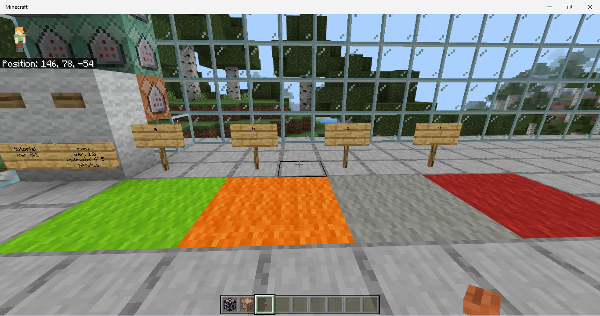

# BDI on Mincraft Bedrock
うつの程度を評価してくれるテストをMinecraft統合版で行えるようにしたときに使ったコマンドです。
BDIの設問文や結果の日本語訳は[https://www.sannoclinic.jp/bdi.html](https://www.sannoclinic.jp/bdi.html)を参考にさせていただきました。

# インターフェスの例


# コマンドについて
(): この括弧書きとその中身は入力しないでください。括弧中のdelayはtickrateが20の時のtick数です。

1. 初期化
```
/scoreboard objectives add bdi dummy BDI
/scoreboard players set @p bdi 0
/title @p times 0 220 0
```
2. 設問と選択肢の表示
```
/title @p title 1.
/titleraw @p subtitle {"rawtext":[{"text":"a: 憂うつではない\nb: 憂うつである\nc: いつも憂うつから逃れることができない\nd: 耐えがたいほど、憂うつで不幸である"}]}
```
3. 看板もしくはランプの形 (0-3や◎○△×など) に従った選択肢を選択し (0-3) の点を変数へ加算していく。 
```
/execute @p ~ ~ ~ detect ~ ~-1 ~ wool 1 scoreboard players add @p bdi 1　(delay 220)
/execute @p ~ ~ ~ detect ~ ~-1 ~ wool 8 scoreboard players add @p bdi 2
/execute @p ~ ~ ~ detect ~ ~-1 ~ wool 14 scoreboard players add @p bdi 3
```
4. 2と3のループを設問数分だけ行い合計点を得る。

```
/title @p title 2.
/titleraw @p subtitle {"rawtext":[{"text":"a: 将来について悲観してはいない\nb: 将来について悲観している\nc: 将来に希望がない\nd: 将来に何の希望もなく、良くなる可能性もない"}]}
/execute @p ~ ~ ~ detect ~ ~-1 ~ wool 1 scoreboard players add @p bdi 1　(delay 220)
/execute @p ~ ~ ~ detect ~ ~-1 ~ wool 8 scoreboard players add @p bdi 2
/execute @p ~ ~ ~ detect ~ ~-1 ~ wool 14 scoreboard players add @p bdi 3

/title @p title 3.
/titleraw @p subtitle {"rawtext":[{"text":"a: それほど失敗するようには感じない\nb: 普通より、よく失敗するように思う\nc: 過去のことをふりかえれば、失敗のことばかり思い出す\nd: 人間として全く失敗だと思う"}]}
/execute @p ~ ~ ~ detect ~ ~-1 ~ wool 1 scoreboard players add @p bdi 1　(delay 220)
/execute @p ~ ~ ~ detect ~ ~-1 ~ wool 8 scoreboard players add @p bdi 2
/execute @p ~ ~ ~ detect ~ ~-1 ~ wool 14 scoreboard players add @p bdi 3

/title @p title 4.
/titleraw @p subtitle {"rawtext":[{"text":"a: 以前と同じように満足している\nb: 以前のようにものごとが楽しめなくなった\nc: もう本当の意味で満足することなどできない\nd: 何もかもうんざりする"}]}
/execute @p ~ ~ ~ detect ~ ~-1 ~ wool 1 scoreboard players add @p bdi 1　(delay 220)
/execute @p ~ ~ ~ detect ~ ~-1 ~ wool 8 scoreboard players add @p bdi 2
/execute @p ~ ~ ~ detect ~ ~-1 ~ wool 14 scoreboard players add @p bdi 3

/title @p title 5.
/titleraw @p subtitle {"rawtext":[{"text":"a: 罪の意識など感じない\nb: ときどき罪の意識を感じる\nc: ほとんどいつも罪の意識を感じる\nd: いつも罪の意識を感じる"}]}
/execute @p ~ ~ ~ detect ~ ~-1 ~ wool 1 scoreboard players add @p bdi 1　(delay 220)
/execute @p ~ ~ ~ detect ~ ~-1 ~ wool 8 scoreboard players add @p bdi 2
/execute @p ~ ~ ~ detect ~ ~-1 ~ wool 14 scoreboard players add @p bdi 3

/title @p title 6.
/titleraw @p subtitle {"rawtext":[{"text":"a: 罰を受けるとは思わない\nb: 罰を受けるかもしれない\nc: 罰を受けると思う\nd: 今、罰を受けていると思う"}]}
/execute @p ~ ~ ~ detect ~ ~-1 ~ wool 1 scoreboard players add @p bdi 1　(delay 220)
/execute @p ~ ~ ~ detect ~ ~-1 ~ wool 8 scoreboard players add @p bdi 2
/execute @p ~ ~ ~ detect ~ ~-1 ~ wool 14 scoreboard players add @p bdi 3

/title @p title 7.
/titleraw @p subtitle {"rawtext":[{"text":"a: 自分自身に失望してはいない\nb: 自分自身に失望している\nc: 自分自身にうんざりする\nd: 自分自身を憎む"}]}
/execute @p ~ ~ ~ detect ~ ~-1 ~ wool 1 scoreboard players add @p bdi 1　(delay 220)
/execute @p ~ ~ ~ detect ~ ~-1 ~ wool 8 scoreboard players add @p bdi 2
/execute @p ~ ~ ~ detect ~ ~-1 ~ wool 14 scoreboard players add @p bdi 3

/title @p title 8.
/titleraw @p subtitle {"rawtext":[{"text":"a: 他の人より自分が劣っているとは思わない\nb: 自分の欠点やあやまちに対し批判的である\nc: 自分の失敗に対していつも自らを責める\nd: 何か悪いことが起こると、自分のせいだと自らを責める"}]}
/execute @p ~ ~ ~ detect ~ ~-1 ~ wool 1 scoreboard players add @p bdi 1　(delay 220)
/execute @p ~ ~ ~ detect ~ ~-1 ~ wool 8 scoreboard players add @p bdi 2
/execute @p ~ ~ ~ detect ~ ~-1 ~ wool 14 scoreboard players add @p bdi 3

/title @p title 9.
/titleraw @p subtitle {"rawtext":[{"text":"a: 自殺しようと全く思わない\nb: 死にたいと思うことはあるが、自殺を実行しようとは思わない\nc: 自殺したいと思う\nd: チャンスがあれば自殺するつもりである"}]}
/execute @p ~ ~ ~ detect ~ ~-1 ~ wool 1 scoreboard players add @p bdi 1　(delay 220)
/execute @p ~ ~ ~ detect ~ ~-1 ~ wool 8 scoreboard players add @p bdi 2
/execute @p ~ ~ ~ detect ~ ~-1 ~ wool 14 scoreboard players add @p bdi 3

/title @p title 10.
/titleraw @p subtitle {"rawtext":[{"text":"a: いつも以上に泣くことはない\nb: 以前よりも泣く\nc: いつも泣いてばかりいる\nd: 以前は泣くことができたが、今はそうしたくても泣くこともできない"}]}
/execute @p ~ ~ ~ detect ~ ~-1 ~ wool 1 scoreboard players add @p bdi 1　(delay 220)
/execute @p ~ ~ ~ detect ~ ~-1 ~ wool 8 scoreboard players add @p bdi 2
/execute @p ~ ~ ~ detect ~ ~-1 ~ wool 14 scoreboard players add @p bdi 3

/title @p title 11.
/titleraw @p subtitle {"rawtext":[{"text":"a: イライラしていない\nb: いつもより少しイライラしている\nc: しょっちゅうイライラしている\nd: 現在はたえずイライラしている"}]}
/execute @p ~ ~ ~ detect ~ ~-1 ~ wool 1 scoreboard players add @p bdi 1　(delay 220)
/execute @p ~ ~ ~ detect ~ ~-1 ~ wool 8 scoreboard players add @p bdi 2
/execute @p ~ ~ ~ detect ~ ~-1 ~ wool 14 scoreboard players add @p bdi 3

/title @p title 12.
/titleraw @p subtitle {"rawtext":[{"text":"a: 他の人に対する関心を失っていない\nb: 以前より他の人に対する関心がなくなった\nc: 他の人に対する関心をほとんど失った \nd: 他の人に対する関心を全く失った"}]}
/execute @p ~ ~ ~ detect ~ ~-1 ~ wool 1 scoreboard players add @p bdi 1　(delay 220)
/execute @p ~ ~ ~ detect ~ ~-1 ~ wool 8 scoreboard players add @p bdi 2
/execute @p ~ ~ ~ detect ~ ~-1 ~ wool 14 scoreboard players add @p bdi 3

/title @p title 13.
/titleraw @p subtitle {"rawtext":[{"text":"a: いつもと同じように決断することができる\nb: 以前より決断をのばす\nc: 以前より決断がはるかに難しい\nd: もはや全く決断することができない"}]}
/execute @p ~ ~ ~ detect ~ ~-1 ~ wool 1 scoreboard players add @p bdi 1　(delay 220)
/execute @p ~ ~ ~ detect ~ ~-1 ~ wool 8 scoreboard players add @p bdi 2
/execute @p ~ ~ ~ detect ~ ~-1 ~ wool 14 scoreboard players add @p bdi 3

/title @p title 14.
/titleraw @p subtitle {"rawtext":[{"text":"a: 以前より醜いとは思わない\nb: 老けて見えるのでないか、魅力がないのではないかと心配である\nc: もう自分には魅力がなくなったように感じる\nd: 自分は醜いにちがいないと思う"}]}
/execute @p ~ ~ ~ detect ~ ~-1 ~ wool 1 scoreboard players add @p bdi 1　(delay 220)
/execute @p ~ ~ ~ detect ~ ~-1 ~ wool 8 scoreboard players add @p bdi 2
/execute @p ~ ~ ~ detect ~ ~-1 ~ wool 14 scoreboard players add @p bdi 3

/title @p title 15.
/titleraw @p subtitle {"rawtext":[{"text":"a: いつもどおりに働ける\nb: 何かやり始めるのにいつもより努力が必要である\nc: 何をやるのにも大変な努力がいる\nd: 何をすることもできない"}]}
/execute @p ~ ~ ~ detect ~ ~-1 ~ wool 1 scoreboard players add @p bdi 1　(delay 220)
/execute @p ~ ~ ~ detect ~ ~-1 ~ wool 8 scoreboard players add @p bdi 2
/execute @p ~ ~ ~ detect ~ ~-1 ~ wool 14 scoreboard players add @p bdi 3

/title @p title 16.
/titleraw @p subtitle {"rawtext":[{"text":"a: 	いつもどおりよく眠れる\nb: いつもよりも眠れない\nc: いつもより 1 ～ 2 時間早く目が覚め、再び寝つくことが難しい\nd: いつもより数時間も早く目が覚め、再び寝つくことができない"}]}
/execute @p ~ ~ ~ detect ~ ~-1 ~ wool 1 scoreboard players add @p bdi 1　(delay 220)
/execute @p ~ ~ ~ detect ~ ~-1 ~ wool 8 scoreboard players add @p bdi 2
/execute @p ~ ~ ~ detect ~ ~-1 ~ wool 14 scoreboard players add @p bdi 3

/title @p title 17.
/titleraw @p subtitle {"rawtext":[{"text":"a: いつもより疲れた感じはしない\nb: 以前より疲れやすい\nc: ほとんど何をやるのにも疲れる\nd: 疲れて何もできない"}]}
/execute @p ~ ~ ~ detect ~ ~-1 ~ wool 1 scoreboard players add @p bdi 1　(delay 220)
/execute @p ~ ~ ~ detect ~ ~-1 ~ wool 8 scoreboard players add @p bdi 2
/execute @p ~ ~ ~ detect ~ ~-1 ~ wool 14 scoreboard players add @p bdi 3

/title @p title 18.
/titleraw @p subtitle {"rawtext":[{"text":"a: いつもどおり食欲はある\nb: いつもより食欲がない\nc: ほとんど食欲がない\nd: 全く食欲がない"}]}
/execute @p ~ ~ ~ detect ~ ~-1 ~ wool 1 scoreboard players add @p bdi 1　(delay 220)
/execute @p ~ ~ ~ detect ~ ~-1 ~ wool 8 scoreboard players add @p bdi 2
/execute @p ~ ~ ~ detect ~ ~-1 ~ wool 14 scoreboard players add @p bdi 3

/title @p title 19.
/titleraw @p subtitle {"rawtext":[{"text":"a: 最近それほどやせたということはない\nb: 最近 2 kg 以上やせた\nc: 最近 4 kg 以上やせた\nd: 最近 6 kg 以上やせた"}]}
/execute @p ~ ~ ~ detect ~ ~-1 ~ wool 1 scoreboard players add @p bdi 1　(delay 220)
/execute @p ~ ~ ~ detect ~ ~-1 ~ wool 8 scoreboard players add @p bdi 2
/execute @p ~ ~ ~ detect ~ ~-1 ~ wool 14 scoreboard players add @p bdi 3

/title @p title 20.
/titleraw @p subtitle {"rawtext":[{"text":"a: 自分の健康のことをいつも以上に心配することはない\nb: どこかが痛いとか、胃が悪いとか、便秘など自分の身体の調子を気遣う\nc: 自分の身体の具合のことばかり心配し、他のことがあまり考えられない\nd: 自分の身体の具合のことばかり心配し、他のことを全く考えられない"}]}
/execute @p ~ ~ ~ detect ~ ~-1 ~ wool 1 scoreboard players add @p bdi 1　(delay 220)
/execute @p ~ ~ ~ detect ~ ~-1 ~ wool 8 scoreboard players add @p bdi 2
/execute @p ~ ~ ~ detect ~ ~-1 ~ wool 14 scoreboard players add @p bdi 3

/title @p title 21.
/titleraw @p subtitle {"rawtext":[{"text":"a: 性欲はいつもとかわりない\nb: 以前と比べて性欲がない\nc: 性欲がほとんどない\nd: 性欲が全くない"}]}
/execute @p ~ ~ ~ detect ~ ~-1 ~ wool 1 scoreboard players add @p bdi 1　(delay 220)
/execute @p ~ ~ ~ detect ~ ~-1 ~ wool 8 scoreboard players add @p bdi 2
/execute @p ~ ~ ~ detect ~ ~-1 ~ wool 14 scoreboard players add @p bdi 3
```

5. 合計点を元に6段階でうつの程度を分類して結果に応じて色の違うブロックをコマンドブロック実行者に渡す。
```
/title @p reset
/title @p clear
/title @p[scores={bdi=..10}] title 0-10; 緑色の羊毛
/title @p[scores={bdi=..10}] subtitle この程度の落ち込みは正常範囲です。ただの憂うつな状態です。
/title @p[scores={bdi=11..16}] title 11-16; 黄色の羊毛
/title @p[scores={bdi=11..16}] subtitle ノイローゼ気味です。軽いうつ状態です。
/title @p[scores={bdi=17..20}] title 17-20; 黄色の羊毛
/title @p[scores={bdi=17..20}] subtitle 臨床的な意味でのうつ状態との境界です。専門家の治療が必要です。
/title @p[scores={bdi=21..30}] title 21-30; オレンジの羊毛
/title @p[scores={bdi=21..30}] subtitle 中程度のうつ状態です。専門家の治療が必要です。
/title @p[scores={bdi=31..40}] title 31-40; 赤の羊毛
/title @p[scores={bdi=31..40}] subtitle 重いうつ状態です。専門家の治療が必要です。
/title @p[scores={bdi=40..}] title 41-; 赤の羊毛
/title @p[scores={bdi=40..}] subtitle 極度のうつ状態です。専門家の治療が必要です。
/give @p[scores={bdi=..10}] wool 1 13 (緑)
/give @p[scores={bdi=11..16}] wool 1 5 (黄緑)
/give @p[scores={bdi=17..20}] wool 1 4 (黄色)
/give @p[scores={bdi=21..30}] wool 1 1 (オレンジ)
/give @p[scores={bdi=31..40}] wool 1 14 (赤)
/give @p[scores={bdi=41..}] wool 1 14 (赤)
/title @p title 色付きの羊毛を渡しました。
/title @p subtitle 毎日続けてブロックを並べることで、体調の波がわかります。
```